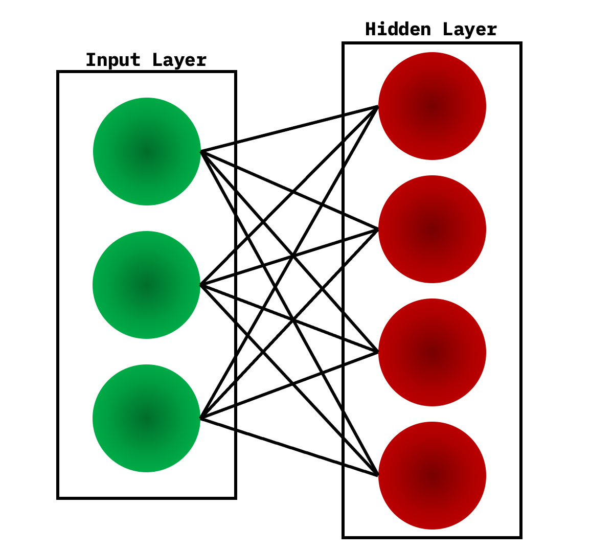
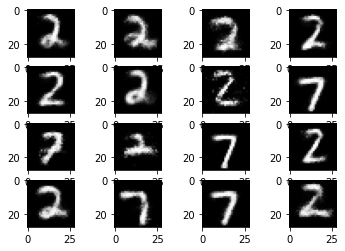
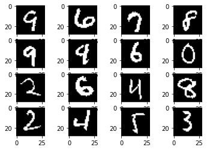
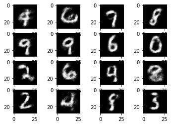
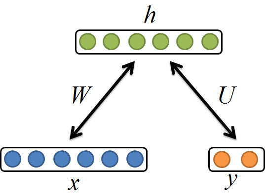

# Restricted_Boltzmann_machine_MNIST
Classification et génération d'images MNIST à l'aide de machine restreinte de Boltzmann :  

Une machine de Boltzmann restreinte est une champs de Markov à une couche cachée que l'on peux représenter de la façon suivante :  

  

La méthode utiliser ici pour calculer les paramètres du modèle est celle de l'echantillonge de Gibbs.  

### I) Génération
Génération des chiffres 2 et 7 à partir d'images MNIST et de la machine de Boltzmann restreinte construite : 
  
  
    
Génération des 10 chiffres à partir d'images MNIST et de la machine de Boltzmann restreinte construite :  
  
    
   
 ### II) Classification
 Pour faire de la classification avec une machine restreinte de Boltzmann il suffit de modifier légèrement la fonction d'énergie en y introduisant les labels, on obtient alors un nouveau modèle du type suivant :  
   

  

   
 Comme le montre le tableau ci dessous on observe une diminution de l'accuracy quand on augmente le nombre de labels.  
 
 | Nombre de labels |  Train Accuracy |  Test Accuracy |
|-----------|-----------|-----------|
| 2 | 98.2% | 97.2% |
| 10 |     85.2%      |     85.4%      |
 

