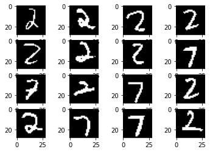

# Restricted_Boltzmann_machine_MNIST
Classification et génération d'images MNIST à l'aide de machine restreinte de Boltzmann
### I) Génération
Génération de deux chiffres ( 2 et 7 ) à partir d'images MNIST et de la machine de Boltzmann restreinte construite :  

